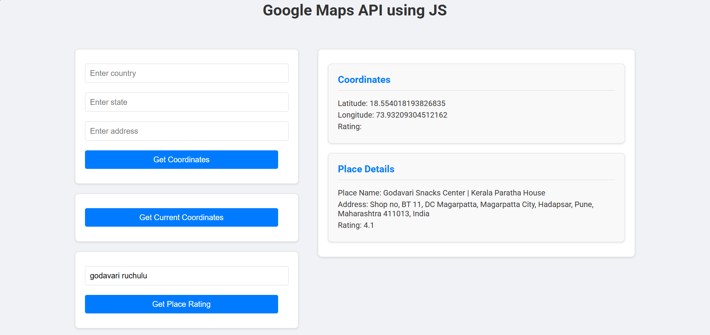

# Google Maps Project

This project demonstrates how to integrate Google Maps into a web application using the Google Maps JavaScript API. You'll learn how to set up a Google Cloud project, enable the necessary APIs, create an API key, and load the Google Maps API in your web application. We'll also cover how to create a map DOM element, initialize the map, and use various methods provided by the Google Maps API.



## Getting Started

### 1. Create a Google Cloud Project
1. Go over to the [Google Cloud Console](https://console.cloud.google.com/).
2. Click on the project dropdown at the top left and select "New Project".
3. Enter a project name and click "Create".

### 2. Enable the Google Maps JavaScript API
1. Navigate to the [Google Maps Platform](https://console.cloud.google.com/google/maps-apis/overview).
2. Select your project from the project dropdown.
3. Click on "Enable APIs" in the project overview.
4. Click "Enable APIs" to enable the API for your project.

### 3. Create an API Key
1. In the Google Cloud Console, go to the [Credentials](https://console.cloud.google.com/apis/credentials) page.
2. Click on "Create Credentials" and select "API Key".
3. Copy the generated API key.
4. Replace `YOUR_API_KEY` in the `index.html` file with your actual API key:
   ```html
   <script src="https://maps.googleapis.com/maps/api/js?key=YOUR_API_KEY&callback=initMap&libraries=places&v=weekly" defer></script>
   ```

### 4. Set Up the Web Application
1. Clone the repository:
   ```sh
   git clone https://github.com/BharanikumaranM/Google-Maps-API-JS.git
   cd google-maps-api-js
   ```
2. Open `index.html` in your preferred web browser.

### 5. Create a Web Mapping Application
1. Load the Google Maps API inside your web application using the script tag.
2. Create a map DOM element (a `div` element) that will contain the map.
3. Create a map object using JavaScript.
4. Specify map options to initialize the map.

### 6. Loading the Google Maps API
There are three ways to load the Google Maps API:
1. Use dynamic library import.
2. Use the NPM `js-api-loader` package.
3. Use the legacy script loading tag (as shown in this project).

### 7. Using the Script Tag
1. Provide the URL to the script tag to load all the definitions and symbols needed for using the Google Maps API.
2. Use the `async` attribute to render the rest of the website while the Maps API loads.
3. When the API is ready, it calls the `initMap` function using the `callback` parameter.


### 8. Create a Map Class
Use the `google.maps.Map` class to create a map object and access various methods provided by the Google Maps API.

## Additional Resources
Visit the [Google Maps JavaScript API Documentation](https://developers.google.com/maps/documentation/javascript) to learn more about the available services and how to use them. The Google Cloud API supports many more frameworks and languages.

